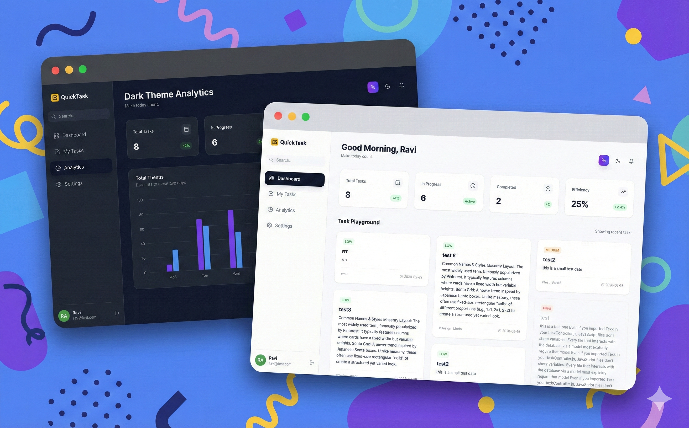

# QuickTask - Intelligent Project Management System



## 🚀 Overview
QuickTask is a modern, full-stack project management application designed to merge aesthetic minimalism with powerful functionality. It features a responsive React frontend, a robust Node.js/Express backend, and a dedicated Python microservice for advanced productivity analytics.

**Core Philosophy:** "Organize chaos. Amplify focus."

## 🏗️ Architecture
The project follows a microservice-inspired architecture divided into three distinct parts:

| Service | Technology Stack | Port | Description |
| :--- | :--- | :--- | :--- |
| **Client** | React, TypeScript, Vite, Tailwind CSS | `3000` | The user interface and dashboard. |
| **Server** | Node.js, Express, MongoDB (Mongoose) | `5001` | REST API for auth, users, and task CRUD. |
| **Analytics** | Python, FastAPI, PyMongo, Pandas | `8000` | Microservice for calculating user productivity stats. |

---

## ✨ Features
* **Authentication:** Secure JWT-based registration and login.
* **Task Management:** Create, read, update, and delete tasks with priorities, tags, and due dates.
* **Smart Dashboard:** Masonry grid layout with "Pinterest-style" card distribution.
* **Advanced Analytics:** Real-time visualization of completion rates, weekly productivity, and task distribution (powered by Python).
* **Dark Mode:** Fully supported system-wide dark/light theme toggling.
* **Responsive Design:** Optimized for Desktop, Tablet, and Mobile.

---

## 🛠️ Installation & Setup

### Prerequisites
* Node.js (v16+)
* Python (v3.8+)
* MongoDB Atlas URI (or local instance)

### 1. Clone the Repository
```bash
git clone [https://github.com/yourusername/quicktask.git](https://github.com/yourusername/quicktask.git)
cd quicktask

```

### 2. Setup Server (Backend)

```bash
cd server
npm install

```

* Create a `.env` file in `server/`:
```env
PORT=5001
MONGO_URI=your_mongodb_connection_string
JWT_SECRET=your_super_secret_key

```


* Start the server:
```bash
npm run dev

```


### 3. Setup Analytics Service (Python)

```bash
cd ../analytics_service
pip install -r requirements.txt

```

* Create a `.env` file in `analytics_service/`:
```env
MONGO_URI=your_mongodb_connection_string

```


* Start the service:
```bash
python main.py

```


### 4. Setup Client (Frontend)

```bash
cd ../client
npm install

```

* Start the client:
```bash
npm run dev

```


---

## 📂 Project Structure

### `client/`

The frontend application built with Vite + React + TypeScript.

* `src/components`: Reusable UI components (TaskCard, MasonryGrid, etc.).
* `src/pages`: Main application views (Dashboard, MyTasks, Analytics).
* `src/services`: API integration layers (Axios configuration).
* `src/context`: React Context for Theme management.

### `server/`

The main backend API built with Node.js & Express.

* `controllers/`: Logic for User and Task operations.
* `models/`: Mongoose schemas for MongoDB data modeling.
* `middleware/`: JWT authentication middleware.
* `routes/`: API route definitions.

### `analytics_service/`

A specialized microservice for data processing.

* `main.py`: FastAPI entry point containing aggregation pipelines.
* Calculates KPIs, efficiency ratings, and productivity trends.

---

## 📄 License

This project is licensed under the MIT License.

---
### Instructions for Submission/Pushing:


1. Initialize Git:
```bash
git init

```


2. **Add Files:**
```bash
git add .

```


3. **Commit:**
```bash
git commit -m "Initial commit: QuickTask v2.0 complete architecture"

```


4. **Push:**
```bash
git branch -M main
git remote add origin https://github.com/YOUR_USERNAME/quicktask.git
git push -u origin main

```